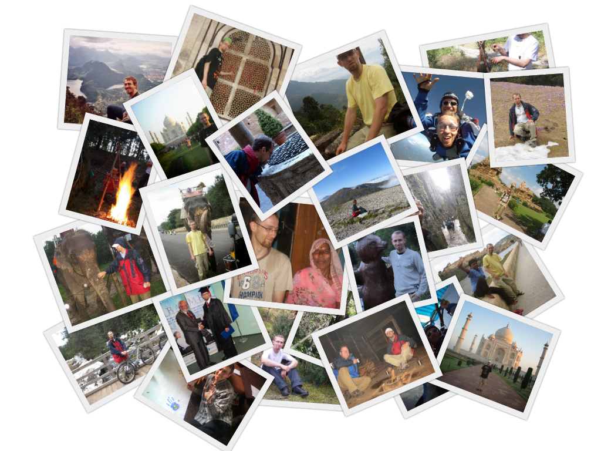

+++
+++

 
 


**Warning!** Page under construction!
It may still not work properly!


 
 

# Welcome!

My name is Szymon. I am a software programmer and this is my personal website. I created it to simplify contact with potential employers and as a way to tell people who I am and what I can do for them. You’ll find here many of my articles, galleries with pictures about some of my travels, samples of my programming work and job-related information. Unfortunately I was able to translate into English only the most important elements. If you speak Polish (which is my native language), you may want to switch into it to get more content. I wish you a pleasant reading.

Szymon Wieloch

 
 
 
 

# Hire Me as a Programmer

My skills are concentrated around software development in the areas of finance, networking and real-time or low-latency systems. I am an expert in low-level programming languages such as C/C++, Rust and Zig. In addition to that I also write microservices in Golang and automation/testing/analytics in Python.

I am currently only interested in remote job offers, mainly from USA, UK and other western countries, preferably as B2B contract. I have a proven record of more than 5 years of delivering high quality software remotely and many years of experience working in primary English-speaking, multicultural environment. I can work in both American and European time zones.


Get in touch



Resume



More


 
 
 
 

# Read My Articles

Lorem Ipsum is simply dummy text of the printing and typesetting industry. Lorem Ipsum has been the industry's standard dummy text ever since the 1500s, when an unknown printer took a galley of type and scrambled it to make a type specimen book. It has survived not only five centuries, but also the leap into electronic typesetting, remaining essentially unchanged. It was popularised in the 1960s with the release of Letraset sheets containing Lorem Ipsum passages, and more recently with desktop publishing software like Aldus PageMaker including versions of Lorem Ipsum.


IT



Finance


 
 
 
 

# Get to Know Me

Thanks to this site you can also learn more about me and my personal life. I have included here many articles that I wrote during my MBA studies, posted on multiple forums or wrote for some befriended blogs. You can also find here pictures from important events in my life.


Galleries



Sport

