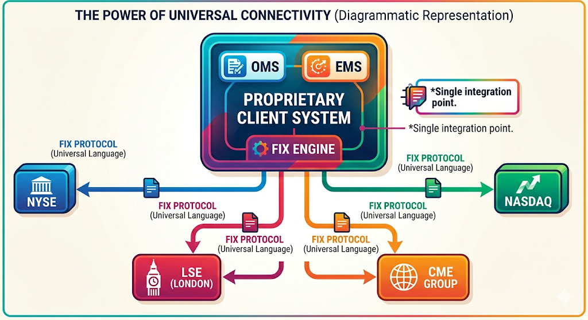
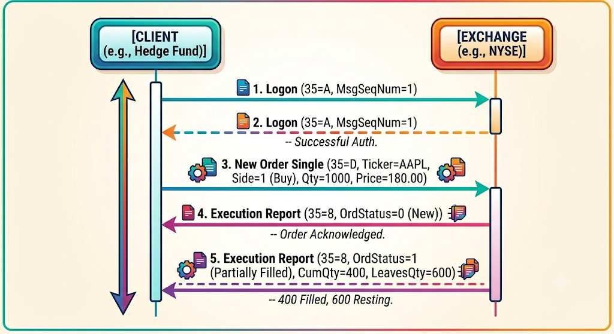

+++
date = '2026-05-18T20:41:19+02:00'
title = 'The Backbone of Modern Trading: Understanding the FIX Protocol'
image = './featured.jpg'
categories = ["Finance"]
+++

In the fast-paced world of electronic trading, speed, accuracy, and reliability are everything. Billions of dollars shift across global markets every day, executed in milliseconds. Behind this seamless flow of financial data lies a unsung hero: the **Financial Information Exchange (FIX) protocol**.

<!--more-->

Introduced in 1992 as a bilateral communication method for equity trading between Salomon Brothers and Fidelity Investments, FIX has evolved into the ubiquitous, open-source standard for institutional trading worldwide.

# The Big Benefit: One Protocol to Rule Them All

Before FIX, the financial industry was a digital Tower of Babel. Every stock exchange, investment bank, and brokerage firm used proprietary software and custom data formats. If a hedge fund wanted to route orders to five different exchanges, they had to build, maintain, and support five entirely different technical integrations.

FIX changed everything by introducing a universal language.

## The Power of Universal Connectivity

The single greatest advantage of the FIX protocol is its **hub-and-spoke efficiency**. Instead of developing unique software pipelines for every market participant, a firm writes a single FIX-compliant interface.



By speaking the same language as virtually every major exchange (like the NYSE, NASDAQ, or London Stock Exchange), a trading desk can connect to multiple liquidity pools using just **one protocol**. This drastically lowers the barrier to entry, slashes development costs, and allows firms to pivot their trading strategies across different global markets with minimal technical friction.

# Anatomy of a FIX Message

At its core, a classic FIX message is a string of text composed of **`tag=value`** pairs, separated by a special delimiter character (traditionally the ASCII `0x01` SOH character, often represented visually by a pipe `|` or a caret `^`).

Every message is divided into a **Header** (identifying who sent it, where it's going, and sequence numbers), a **Body** (the actual data, like stock symbol or price), and a **Trailer** (a checksum for verification).

Here are a few common examples:

## The Heartbeat Message (Type "0")

Used to keep the connection alive during periods of inactivity.

```
8=FIX.4.2|9=48|35=0|49=CLIENT|56=EXCHANGE|34=12|52=20260617-15:30:00|10=142|
```

## New Order Single (Type "D")

Sent by a client to buy 1,000 shares of Apple (AAPL) at a limit price of $180.00.

```
8=FIX.4.2|9=145|35=D|49=CLIENT|56=EXCHANGE|34=13|52=20260617-15:30:05|11=ORD12345|21=1|55=AAPL|54=1|38=1000|40=2|44=180.00|59=0|10=058|
```

**Key Tags Defined:**

* **35=D**: Message type (D = New Order Single)
* **55=AAPL**: Ticker Symbol
* **54=1**: Side (1 = Buy, 2 = Sell)
* **38=1000**: Order Quantity
* **44=180.00**: Price

# Typical Message Flow: Login and Partial Fill

To understand how a FIX session actually works, let’s look at a straightforward, real-world scenario. A client logs into an exchange, submits an order to buy shares, receives a partial match (someone sold them a piece of what they wanted), and the rest of the order rests on the book.



## Breakdown of the Flow:

1. **The Handshake (Logon):** The client sends a `35=A` message containing authentication details. The exchange verifies it and responds with its own `35=A` message. The session is now active, and sequence numbers start counting.
2. **Placing the Order:** The client transmits a New Order Single (`35=D`) requesting 1,000 shares.
3. **The Acknowledgment:** Before trying to fill it, the exchange immediately replies with an Execution Report (`35=8`, where `39=0` meaning "New"). This lets the client know the exchange safely received the order and placed it on the order book.
4. **The Partial Fill:** A seller emerges willing to part with 400 shares. The exchange executes the partial match and sends a new Execution Report (`35=8`). This time, the status is set to *Partially Filled* (`39=1`). The message explicitly states that **400 shares** have been bought (`14=400`), and **600 shares** are still waiting (`151=600`) to be filled.

# Conclusion

The FIX protocol is the foundational plumbing of global finance. By standardizing the way financial institutions talk to one another, it transformed trading from a fragmented web of closed networks into an efficient, interconnected global marketplace. Whether you are a retail trader using an app or an algorithm firing thousands of trades a second, you have the FIX protocol to thank for the speed and liquidity of the modern market.