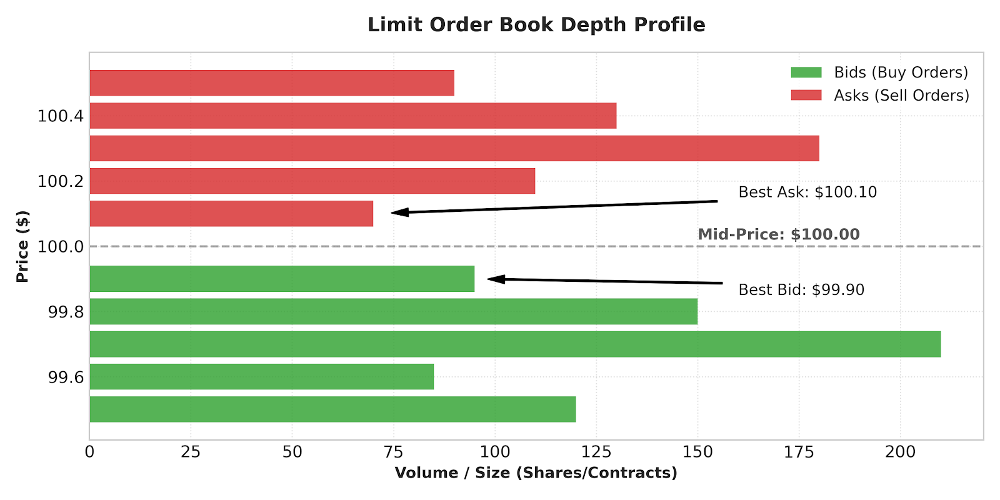
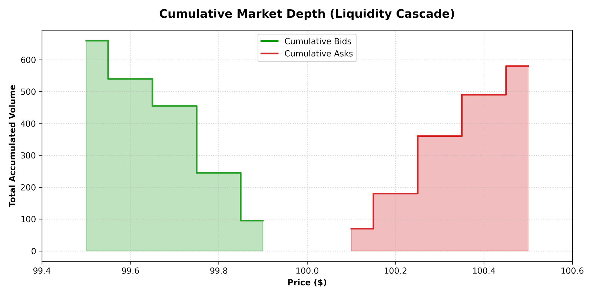

+++
date = '2026-05-18T20:41:19+02:00'
title = 'Anatomy of an Order Book'
image = './featured.jpg'
categories = ["Finance"]
+++

To understand modern financial markets—whether traditional stock exchanges like the NYSE and NASDAQ, cryptocurrency venues, or high-frequency electronic communication networks (ECNs)—one must understand the **Limit Order Book (LOB)**.

<!--more-->



The order book is the structural engine of modern electronic trading. It is a real-time, continuously updating data structure that logs all outstanding, unexecuted buy and sell interest for a specific asset. Every millisecond, matching engines process millions of modifications, cancellations, and trades through this mathematical ledger.

Here is an architectural deep dive into how order books operate, how orders match, and the engineering principles that dictate their mechanics.

An order book is split cleanly down the middle into two distinct halves based on the intent of market participants:

* **The Bid Side (Buyers):** Represents the demand side. It contains orders from participants wishing to buy the asset. Bids are sorted in **descending order**—the highest bid (the most aggressive buyer) sits at the top of the pile.
* **The Ask Side (Sellers):** Also known as the "offers," this represents the supply side. It contains orders from participants wishing to sell the asset. Asks are sorted in **ascending order**—the lowest ask (the most aggressive seller) sits at the top.

# Key Vocabulary of the Ledger

* **Best Bid:** The highest available price a buyer is currently willing to pay.
* **Best Ask / Best Offer:** The lowest available price a seller is currently willing to accept.
* **The Spread:** The difference between the Best Ask and the Best Bid (\(\text{Spread} = \text{Best Ask} - \text{Best Bid}\)). A tight spread typically signals high liquidity.
* **Mid-Price:** The mathematical midpoint of the spread (\(\frac{\text{Best Ask} + \text{Best Bid}}{2}\)). While financial charts often track this price, no transactions actually occur here.
* **Market Depth:** The total volume of resting orders available at various price tiers away from the inside market.

Below is a visualization of a standard order book depth profile, demonstrating how buy and sell intent stack up on either side of the mid-price.

# Order Types: Liquidity Makers vs. Liquidity Takers

To interact with the order book, market participants generally use two fundamental types of instructions. The choice of order determines whether a participant provides or consumes market liquidity.

## Limit Orders (Liquidity Makers)

A **Limit Order** is an instruction to buy or sell a specific quantity of an asset at a specified price *or better*.

* If you place a limit order to buy at $99.90, your order will *only* execute if the market drops to $99.90 or lower.
* If your order cannot be matched immediately against an existing sell order, it is added to the ledger, where it rests as a structural block of market liquidity. Because you are "making" a resting option for others to trade against, you are a **liquidity maker**.

## Market Orders (Liquidity Takers)

A **Market Order** completely ignores structural price limits; it demands immediate execution at the best available current price.

* If you issue a market order to buy 100 shares, the matching engine instantly matches your order against the resting limit orders at the **Best Ask**.
* Because you aggressively consume the options left on the book by makers, you are a **liquidity taker**.

# The Matching Engine Rule: Price-Time Priority

When a new order arrives, how does an exchange determine who gets executed first? The vast majority of electronic markets employ a deterministic scheduling algorithm known as **FIFO (First-In, First-Out)** or **Price-Time Priority**.

The allocation rules are applied in a strict hierarchy:

1. **Price Priority:** The matching engine always rewards the most competitive price. A buy order at $99.90 will *always* execute before a buy order at $99.85. Similarly, a sell order at $100.10 always takes precedence over a sell order at $100.20.
2. **Time Priority:** If two orders enter the book at the exact same price tier, the order that was logged by the engine **first** is filled first. This rule is the primary catalyst behind the high-frequency trading (HFT) "race to the bottom" regarding network latency.

## Walkthrough of a Trade Matching Event

Let’s look at how a incoming market order eats through resting limit orders using the table below as a snapshot:

| Side | Price ($) | Size (Shares) | Order Timestamp |
| --- | --- | --- | --- |
| **Ask** | 100.20 | 110 | 10:00:02.100 |
| **Ask (Best)** | 100.10 | 70 | 10:00:01.050 |
| *-- Spread --* | *100.00 (Mid)* |  |  |
| **Bid (Best)** | 99.90 | 95 | 10:00:00.900 |
| **Bid** | 99.80 | 150 | 10:00:01.150 |

If a trader sends a **Market Order to Buy 100 shares**, the engine processes it sequentially:

1. It queries the **Best Ask** tier ($100.10), finding 70 shares available.
2. It completely fills those 70 shares, exhausting that price tier. The Best Ask tier at $100.10 vanishes from the book.
3. The remaining 30 shares of the buy order cascade upward to the next most aggressive price tier (**$100.20**).
4. The engine executes 30 shares against the resting 110 shares at $100.20, leaving 80 shares resting at that level.

The transaction is complete. Because the market order consumed multiple price tiers to fulfill its volume, the asset experienced minor **slippage**, pushing the new Best Ask up to $100.20.

# Visualizing Market Depth and Liquidity Cascades

Traders look at cumulative market depth to evaluate how resilient an asset is to heavy market buying or selling. By summing up the volumes moving outward from the spread, we get a clear curve of an asset's supply and demand elasticity.

If the walls of a cumulative depth chart are steep, it indicates that massive blocks of shares or contracts can be bought or sold without heavily moving the underlying price. If the slope is flat, even a modest market order can punch through price levels, causing high volatility.

# High-Frequency Dynamics and Under the Hood Engineering

From a computer science perspective, an order book is an exercise in extreme performance optimization. Matching engines must handle bursts of hundreds of thousands of messages per second with deterministic sub-millisecond latencies.

## Data Structure Architecture

To achieve this efficiency, engineers do not use flat arrays or simple binary search trees. Instead, a standard layout employs a hybrid architecture:

* A **Doubly-Linked List** for each distinct price level. Each node in the list represents an individual order. Adding an order to the tail (Time Priority) or removing an order when filled or canceled takes \(O(1)\) constant time.
* A **Sparse Array, B-Tree, or Radix Tree** indexed by price to map out the active price levels. This allows the engine to skip to the next available price tier in \(O(1)\) or \(O(\log n)\) time when a price level is cleared out.

## Market Microstructure Phenomena

Because the order book is transparent, it acts as a playground for complex algorithms:

* **Iceberg Orders:** Large institutional players often don't want to expose their true order sizes because it would move the market against them. They use "iceberg" orders, which expose only a small fraction of their total size to the public ledger while hiding the rest under the surface.
* **Spoofing:** A disruptive algorithmic practice where a machine places massive limit orders deep in the book with absolutely no intention of executing them. The artificial volume creates the illusion of deep support or resistance, manipulating other algorithms into buying or selling before the spoof orders are quickly canceled.

# Conclusion

The electronic limit order book is an elegant, pure expression of real-time supply and demand. By enforcing deterministic mathematical rules like price-time priority, it provides a structured canvas where billions of dollars of global capital can discover true value, tick by tick, microsecond by microsecond.