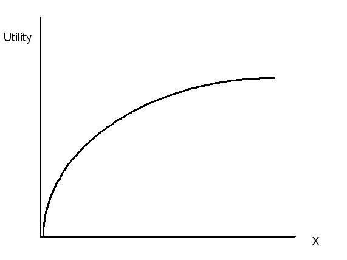
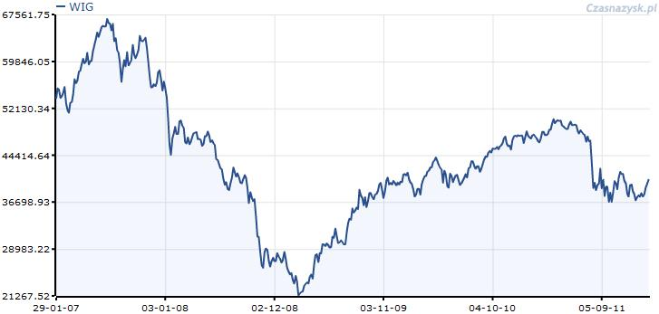
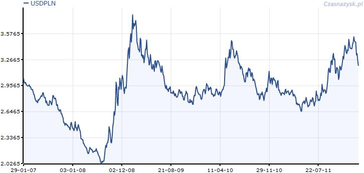
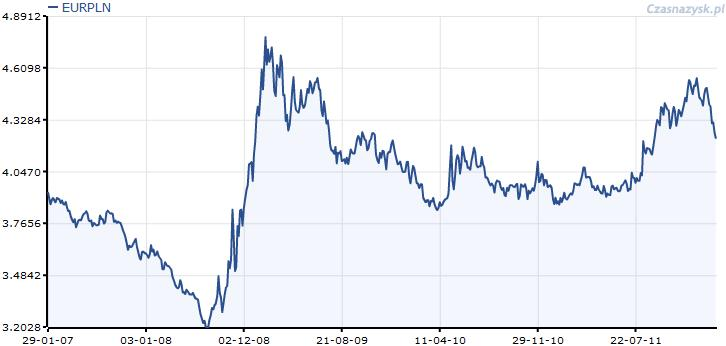
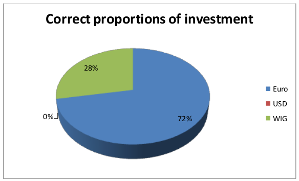
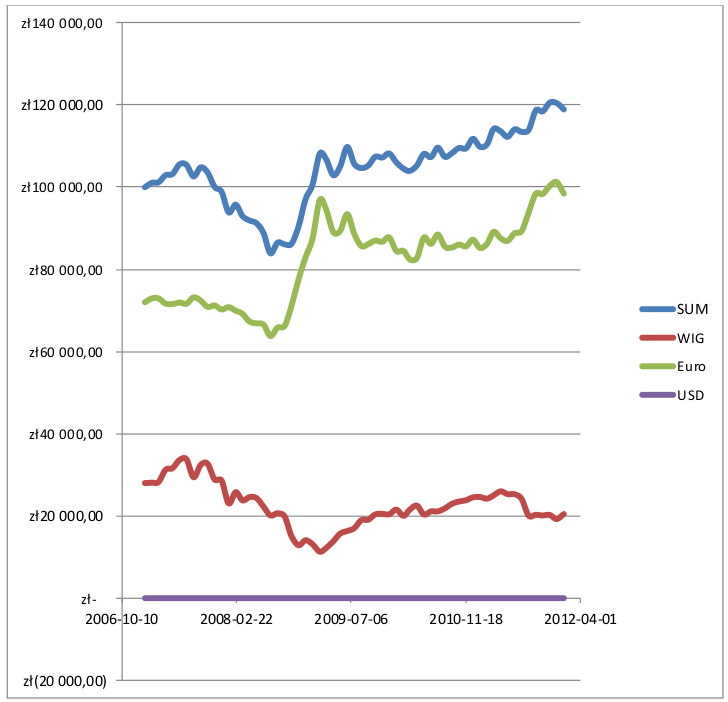

+++
date = '2026-05-18T20:41:19+02:00'
title = 'Simple Investment Strategy During a Global Crisis'
image = './featured.jpg'
categories = ["Finance"]
+++

This article describes a simple investment strategy designed for people who do not have much experience with investing but would like to optimize their gain-to-risk ratio and prevent high losses during potential global crises (as observed around 2012).

<!--more-->



## Introduction

The purpose of this article is to create a simple but effective investment strategy using tools such as diversification and hedging. The strategy is intended for inexperienced investors with limited knowledge of financial markets. The profile of the investor is that of an average risk taker. Part of the money should be invested in stocks, while the other part should be invested in bonds.

The currency used to evaluate the strategy will be the Polish zloty. One of the characteristics of human economic behavior is that a person’s utility function tends not to be linear. Because of its shape, a loss of 70% is perceived differently than an equivalent gain. A large loss is felt more strongly than a large gain. A good strategy should therefore maximize utility rather than gain alone, and for this reason this work concentrates on preventing an investor’s nightmare — a global crisis causing multiple assets to lose their value. The strategy will be tested using economic data from the previous five years. During this period, two economic crises occurred one after another.

Typical utility function.

## Should We Trust Specialists?

We will begin building the strategy by asking a very simple question: shouldn’t we pass our money to financial specialists instead of investing it ourselves? At first, it seems crazy to try to compete on the market with banks and funds that spend billions of dollars each year on market analysis. Isn’t it better to trust a fund and leave the main decisions to professionals? Our intuition suggests that this should be a better idea than using our own limited skills to find and buy good stocks.

However, practice shows something very different. The Stockwatch.pl portal analyzed stock funds and found that the majority of them (more than 70%) achieved worse results than the WIG index. Furthermore, the risk analysis showed that the Sharpe ratio calculated for most funds was usually below what the market itself had to offer.

| Stock fund             | Sharpe ratio | Average annual gain (%) |
| ---------------------- | ------------ | ----------------------- |
| Arka BZWK Akcji        | 0.20         | 11.49                   |
| Legg Mason Akcji       | 0.20         | 11.14                   |
| UniKorona Akcje        | 0.17         | 10.84                   |
| Skarbiec Akcja         | 0.14         | 10.09                   |
| BPH Akcji              | 0.11         | 9.48                    |
| ING Akcji              | 0.02         | 7.72                    |
| PZU Akcji Krakowiak    | 0.00         | 7.42                    |
| Novo Akcji             | -0.02        | 6.90                    |
| PKO Akcji              | -0.11        | 5.24                    |
| DWS Akcji D.S          | -0.11        | 5.11                    |
| Pioneer Akcji Polskich | -0.10        | 5.09                    |
| **Average**            | **0.05**     | **8.23**                |
| **WIG index**          | **0.13**     | **10.36**               |

Selected Polish stock funds, data from the last 10 years.

These counterintuitive results can be explained using the efficient market hypothesis. There are many different stocks available on the market. Some are better than others, but because many investors are constantly searching for undervalued stocks, the real difference in attractiveness between the best and worst stocks is usually not significant. Even skilled professionals who try to identify the best stocks cannot consistently achieve returns far above the market average.

At the same time, each stock fund has many internal costs. It must pay for marketing, office buildings, and employee salaries. The fund covers these expenses using management fees. In Poland, the average fee is around 4% per year and is approximately twice as high as in the United States. As a result, the average gain obtained with the help of a specialist is often lower than the cost of that assistance.

A very similar phenomenon has been observed in the United States and has contributed to the popularity of index funds. A better strategy than investing in a stock fund may therefore be direct investment in the market. One can simply buy stocks independently, even if this means choosing companies more or less at random.

Direct investment provides attractive expected returns. Unfortunately, buying a single stock also involves a very high standard deviation, resulting in high risk (and therefore a low Sharpe ratio). To eliminate the risk specific to a single company, it is necessary to buy a large number of different stocks. It is estimated that effective diversification requires purchasing around 30–40 different stocks.

It is also worth mentioning that good diversification requires an analysis of interdependencies between stocks. For example, Lotos and Orlen are both strongly dependent on oil prices, so their stock prices are highly correlated. The best solution is to create a portfolio of companies operating in different sectors of the economy.

## How to Prevent Losses During a Global Crisis?

The nightmare of an investor is a global crisis that can cause losses of 50–80% within a short period of time. Recently, there were two such crises: the first was related to the bankruptcy of Lehman Brothers in 2008, and the second to the financial problems of Greece around 2011.

Unfortunately, the WIG index tends to decline dramatically during such periods, resulting in high volatility and substantial losses. One way to reduce such losses is to use a hedging strategy. Part of the money should be invested in Polish stocks, while another part should be invested in assets negatively correlated with the WIG index.

There are many assets that behave in this way. A classic example is gold, because its price often rises during crises. However, since this strategy assumes partial investment in bonds, the best assets meeting our criteria are government bonds issued by countries with strong currencies.

From the perspective of a Polish investor, the best currencies for investment are the US dollar, euro, Swiss franc, and pound sterling. The dollar and euro are the two main international trading currencies, while the franc and pound are considered relatively stable local currencies. Therefore, any local crisis affecting the WIG index may also influence exchange rates. For the sake of simplicity, this document will focus on the dollar and euro.

The following charts show that there is at least some correlation between the WIG index and currency exchange rates.

## Building the Strategy

We already know the basic structure of the strategy. It is based on investment in stocks of many Polish companies combined with investments in foreign government bonds denominated in US dollars and euros. What remains unclear are the proportions of these investments. How much should be invested in US or European bonds, and how much in Polish stocks?

The answer can only be based on past behavior of exchange rates and the WIG index. By analyzing data from the previous five years, we can calculate the proportions that minimize risk. Since the primary purpose of the strategy is to reduce risk during crises, the annual standard deviation of returns was used as the risk metric for different combinations of investments. The calculations are attached to this document in the form of a spreadsheet.

### Assumptions of the calculations

* The value of the portion invested in Polish stocks changes in the same way as the WIG index.
* The value of the portion invested in foreign government bonds changes because of exchange-rate fluctuations and bond interest rates — 3% for US bonds and 4% for average European bonds.
* The metric used to evaluate the strategy is the standard deviation of the portfolio.
* The lower the standard deviation, the safer the investment.
* High returns are not expected during a crisis.
* The cost of exchanging currencies is negligible.
* The values of the WIG index and exchange rates were checked once a month. (The calculations could be improved by checking values daily, but for the sake of simplicity monthly observations were used.)
* No debt (leverage) is allowed.

It is possible to determine the proportions through numerical analysis. Because most common applications do not allow simultaneous optimization of two variables, the solution can be found manually by modifying the percentage invested in euros until the smallest standard deviation is identified. Later, the percentage invested in dollars can be adjusted in a similar way. By repeating this process until any further change increases the risk metric, it is possible to find the optimal solution.

## Final Strategy

The simulation showed that the best investment proportions were 28% Polish stocks, 72% European bonds, and 0% American bonds. The last value is particularly interesting. Negative values were not tested because the strategy assumes no leverage, but it might theoretically be profitable to borrow dollars and invest more money in euros and Polish stocks.

Unfortunately, these proportions are based on historical data, and there is no guarantee that they will remain optimal during future crises.

Best investment proportions.

It appears that the euro is a better hedging currency than the US dollar. During the crisis period, the investment achieved an attractive return of 3.53% per year. Considering the 4% interest rate on euro-denominated bonds and the fact that this return was measured during two crises, the result is quite impressive.

At the same time, the investment also had an attractive standard deviation — only 8.99% at its worst. This value is small compared to the WIG index, which at one point lost 67% of its value.

It is also interesting to estimate the expected return outside periods of crisis. Assuming that exchange rates remain unchanged, the expected gain can be calculated as follows:

$$EG = 28\% \cdot 10.36\% + 0\% \cdot 3\% + 72\% \cdot 4\% = 5.79\%
$$

The final chart shows how combining three different types of investments reduces overall portfolio volatility.

