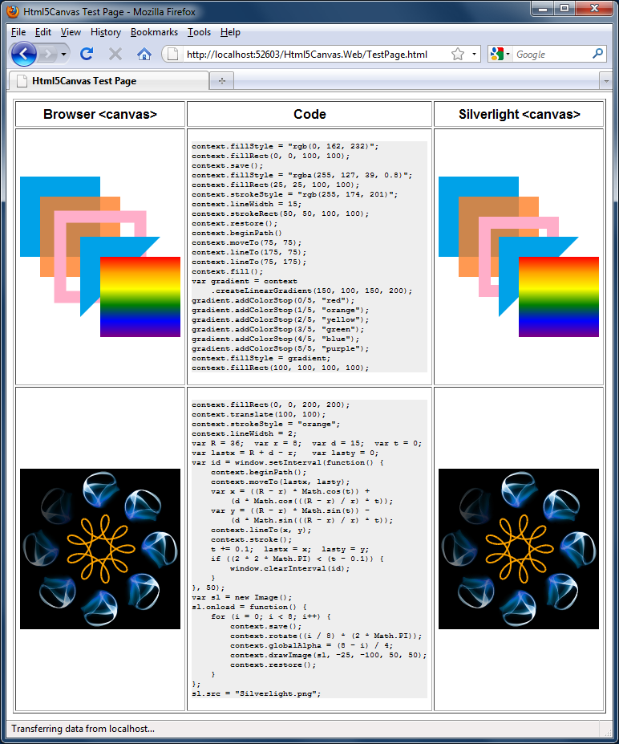
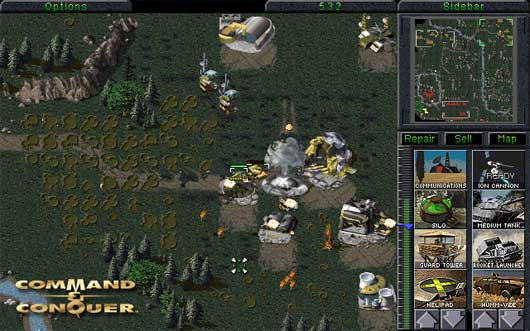
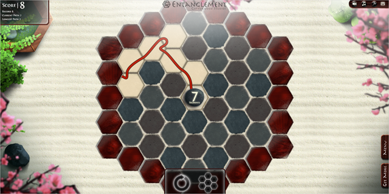
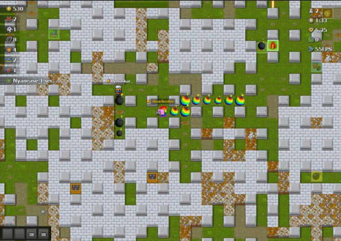
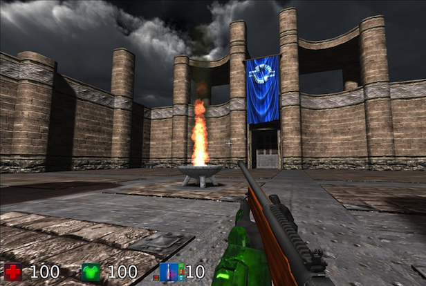
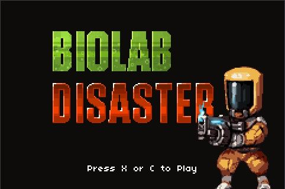

+++
date = '2026-05-18T19:17:52+02:00'
draft = false
title = 'Computer Games in HTML5'
image = './featured.jpg'
+++

When HTML5 appeared on the programming scene, a new trend emerged – computer games running in a browser (and not using Flash). Maybe those games constitute the future of modern entertainment?…

Most computer games created in HTML5 are two-dimensional and use a new HTML element introduced in the fifth version: the canvas. Canvas is almost like a Paint application running in your browser, and your JavaScript code can freely draw on it. It’s enough to draw 25 frames per second to achieve the illusion of smooth movement.

An exemplary use of the canvas and a comparison with its alternative – the Microsoft Silverlight plugin – is shown above.

Unfortunately, JavaScript is not a very fast programming language, and the canvas does introduce additional overhead. To achieve smooth movement, you frequently need to employ many tricks. For example, you can redraw only a part of the screen; create layers such as objects and background, where you only modify the first one; and many others. It is also necessary to periodically profile your game to make sure you haven’t exceeded the browser’s capabilities.

One of the problems with JavaScript is that it is, by design, single-threaded and asynchronous. This approach works perfectly well with normal text-based websites. However, this is currently a limitation because it doesn’t use modern multi-core processors effectively. To bypass this limitation, a new “Worker” object was introduced in the JavaScript standard. It allows offloading some work to another thread (for example, a time-consuming search for a path on the board can be executed in a worker while the main thread is busy rendering graphics).

Another new HTML5 component used by games is the “audio” tag. It embeds sounds in the website, and later those sounds can be controlled by JavaScript and played when an event takes place (for example, an explosion sound is played when the player succeeds in hitting an object with their gun).

An alternative to canvas is the use of the “WebGL” library, which is unfortunately not yet supported by all browsers. However, it allows creating three-dimensional computer games with quality comparable to commercial games using DirectX.

## Examples of Great Games

This article would be of little worth without some excellent game examples. The following is a short list of HTML5 games in a variety of genres that I personally find amusing.

## Command & Conquer

One fan of the classic game Command & Conquer decided to convert this game from its original DOS environment into a browser. To my surprise, this project became a huge success, and the result is one of the best computer games ever made, available right in your browser.

[http://www.adityaravishankar.com/projects/games/command-and-conquer](http://www.adityaravishankar.com/projects/games/command-and-conquer)

## Entanglement

 Something for puzzle game fans. Entanglement offers great graphics and an opportunity to sadistically torment our brain cells. It’s perfect for a short 10-minute break from work.

[http://entanglement.gopherwoodstudios.com](http://entanglement.gopherwoodstudios.com/)

## Game of Bombs

Game of Bombs is the only multiplayer game on this list. A player connects to a server where they compete with other players on large boards. Players try to destroy one another by placing bombs and detonating them, and of course, avoid getting killed themselves. A good piece of entertainment.

[http://gameofbombs.com](http://gameofbombs.com/)

## Bananabread

 Bananabread is a game created by the Mozilla team, and its main purpose is to test the effectiveness of their Firefox browser. The game is fully three-dimensional with great graphics – the result of using the WebGL library. Bananabread is a great first-person shooter where you can compete against computer-controlled players. Unfortunately, the game may not work in Internet Explorer because – as usual – this browser is highly delayed when it comes to implementing modern browser standards.

[https://developer.cdn.mozilla.net/media/uploads/demos/a/z/azakai/3baf4ad7e600cbda06ec46efec5ec3b8/bananabread\_1424465008\_demo\_package/index.html](https://developer.cdn.mozilla.net/media/uploads/demos/a/z/azakai/3baf4ad7e600cbda06ec46efec5ec3b8/bananabread_1424465008_demo_package/index.html)

## Biolab Disaster

Biolab Disaster is a classic two-dimensional platform shooter. You can finish it in 15 minutes.

[http://playbiolab.com](http://playbiolab.com/)