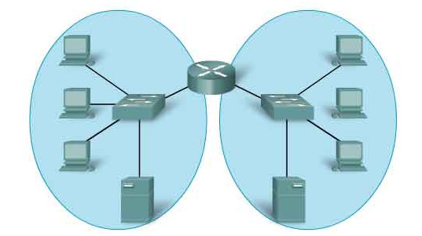
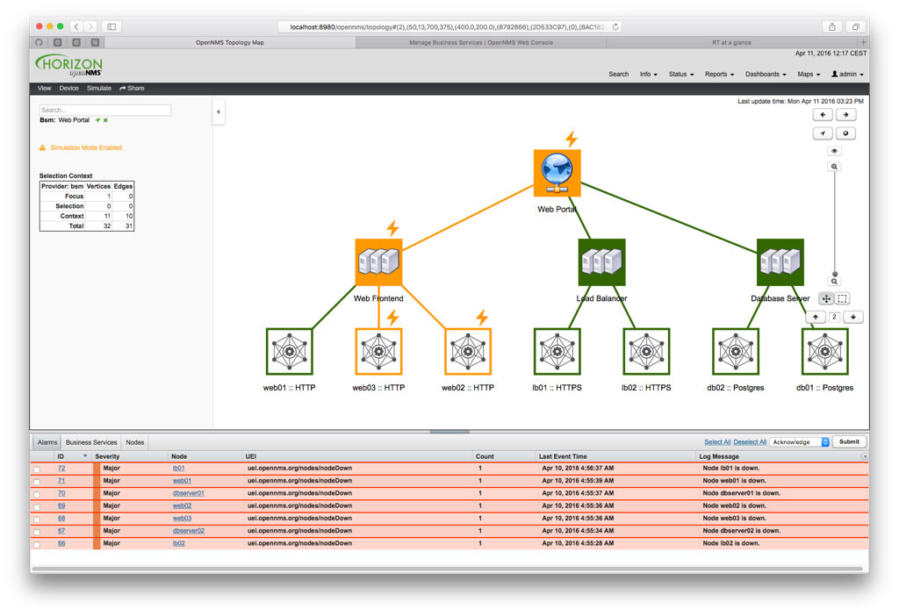

+++
date = '2026-05-18T18:12:12+02:00'
title = 'Discovering Network Topologies'
image = './featured.jpg'
categories = ["IT"]
+++

When you work as a network administrator, there are few more useful tools than an application that discovers your network topology and is capable of drawing it to you and providing all the information about the network.
<!--more-->  
Let's look at several ways to find devices in our network and build connections between them.

## Components of all networks

As you may know, all networks consist of similar components. There are end devices (like the one that you use to read this article), there are switches that connect devices within one IP network and there are routers that connect networks. Devices are connected using cables or WiFi – let’s call these edges. This is how a typical network looks like:

If you want to build that kind of view, first you need to find devices in your network, then you need to obtain information about those devices and finally you need to find edges between them.

## Finding devices

There are two main ways to find devices. The first one is pinging them. For example, if your network is 192.168.0.0/24, then there are 254 possible IP addresses in it. You can ping them one by one. Of course some operating systems by default disable ICMP ping responses and this may be a problem (the same happens when devices have a firewall). But if a device has at least one port open, then it is possible to find it using port scanning. Port scanning is a popular method of sending fake TCP SYN messages and waiting for response. Open ports will send an answer. Fortunately, there are several applications that can handle both pinging and scanning ports. Nmap and masscan are the two most popular ones with nmap being the most reliable and masscan being the fastest (so most suitable for big networks). But even those applications do not have any chance of finding an IPv6 device in a network simply because IPv6 local networks have much more addresses than the whole IPv4 Internet. And this is where we need to use the second method.

The second method is obtaining information from network devices. Almost all network devices support the SNMP protocol. And it gives you an ability to download information about the network if you know the password of your router (if you are a network administrator, then you do). There are also several other ways how you can obtain the same data. For example Windows machines support WMI protocol, most devices support console management (telnet or ssh protocols) and some devices (such as Cisco Meraki) have web management consoles. Regardless of the way, you can download the same information:

- ARP tables with IPs of devices in the network.
- MAC forwarding tables (some devices do not have IPs, for example switches. But you can find their MAC addresses in the MAC forwarding table. A device with MAC address and without IP is probably a layer-2 device such as a switch or repeater).
- IPs of other routers (thanks to routing protocols such as OSPF).
- Devices discovered using Cisco Discovery Protocol or Link Layer Discovery Protocol.

Sometimes a device can be also discovered by analyzing network connections, for example if one interface of a router is connected to three computers, then there is probably a switch in the middle.

## Obtaining device information

Devices that support SNMP and similar protocols allow you to obtain information about them. A set of available information depends highly on the protocol and concrete model, but usually you can obtain:

- Vendor
- Model
- Hostname (or some other name)
- Operating system and its version
- Device type (such as printer, laptop, mobile phone, router)
- Information about hardware
- List of interfaces with assigned IPs
- In case of virtual machine servers – list of running virtual machines

But what about devices that do not support SNMP or any other similar protocol? There are still some ways to learn more about it. Running devices have open ports. By checking what ports are open and sometimes obtaining information from those ports (for example Windows devices commonly run Samba servers with open NetBIOS port that you can connect to and obtain information about the system). For example printers have open printing server ports. Routers have open routing protocol ports etc.

## Discovering edges

Once you know the devices in the network, it’s time to discover the edges between them. This is one of the most difficult parts of the discovery process because there are many different approaches that give you pieces of information about the network and it’s difficult to combine them. Nevertheless let’s look at common methods of discovering links in the network:

-    ARP tables and MAC forwarding tables give you layer-2 information about location of devices in the network. By applying quite a complicated algorithm you should be able to find most of those connections.
-    CDP and LLDP protocols were specifically designed to discover neighboring devices. If your devices support one of those protocols, they should discover themselves and report the edge via SNMP.
-    STP protocol can be used to retrieve information about the tree-like structure of the spanning tree of layer-2 devices and to retrieve at least part of the network.
-    Routing protocols such as OSPF contain a representation of a network and know how they are connected to their neighbor routers.
-    Routing tables can be used to locate the interface where the given IP may be connected.
-   There are also several methods that depend on the underlying protocol. For example serial layer-2 links are almost always direct connections, so if you have only two such interfaces running in one IP network, it’s almost always an edge.

## Let’s try it

The described algorithms eventually get very complex, so implementing them on your own may not be the wisest choice. Fortunately there is an open source project called OpenNMS that is relatively good at discovering a network. It’s free and comes with additional monitoring functionality allowing to check what is currently going on with your devices. You can try it at https://opennms.org.

Exemplary screenshot of OpenNMS.
