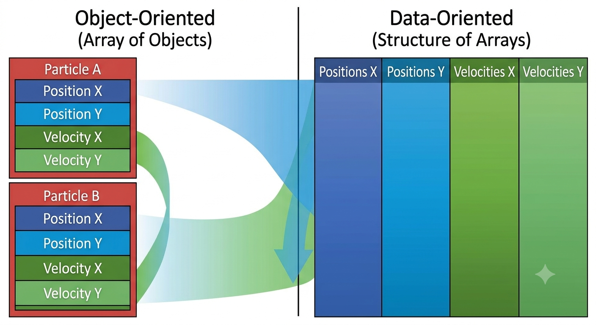
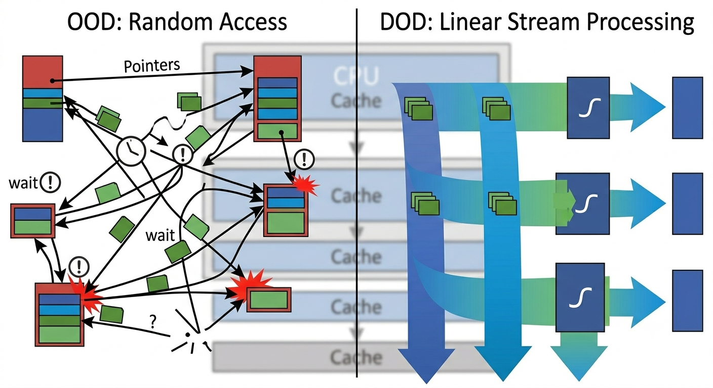

+++
date = '2026-05-18T18:12:12+02:00'
title = 'A Practical Guide to Data-Oriented Design in C++'
image = './featured.jpg'
categories = ["IT"]
+++


Data-Oriented Design (DOD) is a software development paradigm that contrasts sharply with the traditional Object-Oriented Design (OOD). While OOD focuses on objects, encapsulation, and inheritance, DOD prioritizes the data itself—its layout in memory, how it is accessed, and how it transforms. In performance-critical applications like game development or real-time simulation, DOD can offer dramatic speedups by optimizing for the modern CPU's cache hierarchy.

<!--more-->

# The Core Philosophy: Data Over Objects

The fundamental shift in DOD is thinking about data structures before code structures. Instead of asking "What is this object, and what does it do?", DOD asks, "What data do I need to process, and how can I layout that data for efficient access?"

To illustrate, consider a system managing simple 2D particles. In OOD, we might create a `Particle` class:

```cpp
// OOD: Array of Objects (AoO)
class Particle {
public:
    float x, y;
    float vx, vy;
    float mass;
    // ... methods to update and draw
};
std::vector<Particle> particles(10000);

```

While intuitive, this results in an **Array of Objects (AoO)**. This layout places different types of data (position, velocity, mass) together for each particle. When a system *only* needs to update positions (accessing `x, y, vx, vy`), it is forced to load the entire `Particle` object into the cache, including unused fields like `mass`.

The following image visualizes this inefficient layout, showing how unrelated data components are interleaved in memory.



*Comparison of memory layouts. (Left) Object-Oriented AoO puts all data for one particle together. (Right) Data-Oriented SoA organizes data by component type, favoring sequential access.*

# The Solution: Structure of Arrays (SoA)

DOD addresses this by using a **Structure of Arrays (SoA)** approach. Instead of one array of full objects, we have multiple arrays, one for each *component* of the object:

```cpp
// DOD: Structure of Arrays (SoA)
struct ParticleSystem {
    std::vector<float> x, y;
    std::vector<float> vx, vy;
    std::vector<float> mass;
    // ...
    void updatePositions(float dt); // Operates on contiguous x, y, vx, vy
};
ParticleSystem system(10000);

```

As the diagram in Image 1 shows (right side), when we update the particle positions, the CPU reads contiguous blocks of memory for `x`, `y`, `vx`, and `vy`. Modern CPUs are designed to excel at this sequential access pattern. They pre-fetch data from main memory into the high-speed L1/L2 caches before the code even requests it. This dramatically minimizes **cache misses**, the performance bottleneck where the CPU stalls waiting for data.

# Access Patterns: Avoiding the Scatter

Another core concept in DOD is designing systems that process arrays uniformly. We write functions that take these homogenous data arrays as input and output modified arrays. This is sometimes described as stream processing.

Contrast this sequential processing with the random, scattered access often seen in highly complex OOD structures (e.g., linked lists of polymorphic objects). The next visualization builds on the memory layout concepts shown in Image 1, illustrating how a DOD system processes data streams linearly, unlike the chaotic access of OOD.



*Visualization of data access. OOD (Left) causes chaotic, high-latency random access. DOD (Right) processes linear streams of data (like those in Image 1), maximizing cache efficiency.*

# Implementing DOD in C++

C++ provides tight control over memory layout, making it the ideal language for implementing DOD. Key techniques include:

1. **Stop Using Virtual Functions:** Inheritance and virtual functions (`virtual void update()`) require dynamic dispatch via vtables. This introduces pointer indirection and guarantees that the CPU cannot easily predict the next instruction or data location, violating the principles seen in Image 2.
2. **Use Plain Old Data (POD):** Structures should be simple collections of standard types (floats, ints, bools) or arrays. This ensures predictable memory layout and trivial copyability.
3. **Think in Batches:** Don't write a function that updates one `Particle`. Write a system that processes an *array* of `10,000 Particles`.
4. **Embrace ECS:** The Entity-Component-System architectural pattern is a highly structured implementation of DOD. Entities are just IDs, Components are POD structs (like position), and Systems contain the linear processing logic shown in Image 2.

# Conclusion

Data-Oriented Design in C++ represents a shift toward mechanical sympathy—writing code that respects the hardware it runs on. By abandoning convenient but costly abstractions in favor of lean data structures and linear processing, developers can unlock performance that is simply unreachable with pure Object-Oriented paradigms. DOD is not just a style; it is a critical optimization tool for performance-driven software.