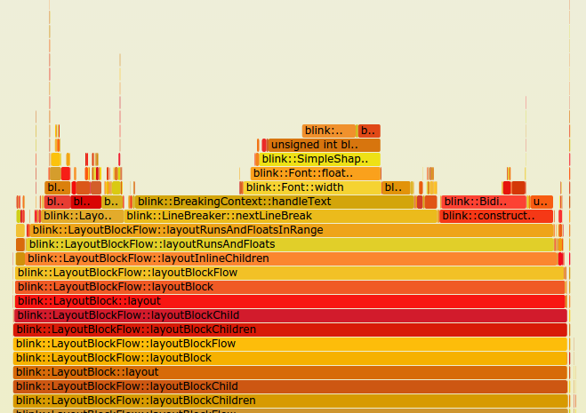

+++
date = '2026-05-18T18:12:12+02:00'
title = 'HarnessingMastering Linux Performance: A Deep Dive into `perf` and Flame Graphs'
image = './featured.jpg'
categories = ["IT"]
+++

In the world of Linux systems engineering, software development, and DevOps, performance bottlenecks are the ultimate enemy. When an application slows down, latency spikes, or CPU usage hits 100%, guessing at the root cause is a recipe for wasted time.

<!--more-->

To solve these complex issues, developers rely on profiling tools. Among the most powerful and lightweight tools available in the Linux ecosystem is **`perf`** (also known as `perf_events`). When combined with **Flame Graphs**, `perf` transforms raw, overwhelming performance metrics into an intuitive, actionable visual story.

---

## What is `perf`?

Introduced in Linux kernel 2.6.31, `perf` is the official subsystem and command-line utility for performance monitoring in Linux. Because it is deeply integrated with the Linux kernel, it can instrument both user-space applications (like your Go, C++, Python, or Java code) and kernel-space events (like file system operations, network activity, and context switching).

Unlike traditional profilers that instrument binaries and introduce heavy runtime overhead, `perf` primarily uses **sampling**. It takes rapid snapshots of the CPU’s instruction pointer and call stacks at a specified frequency (e.g., 99 times a second). This approach keeps overhead remarkably low—often under 1-2%—making it safe to run in live production environments.

### Key Capabilities of `perf`:

* **CPU Profiling:** Find which functions consume the most CPU cycles.
* **Hardware Events:** Track low-level CPU metrics like cache misses, branch mispredictions, and instruction counts.
* **Software Events:** Monitor context switches, page faults, and process scheduling.
* **Tracepoints:** Hook into specific static kernel events (e.g., system calls like `sys_enter_open`).

---

## The Core `perf` Workflow

Using `perf` typically follows a simple three-step lifecycle: **Stat, Record, and Report.**

### 1. Counting Events with `perf stat`

Before diving into a deep profile, you often want a high-level overview. `perf stat` runs a command and outputs a summary of performance counters.

```bash
perf stat ./my_application

```

This will give you a quick health check showing:

* Total CPU cycles and instructions executed.
* **Instructions per Cycle (IPC):** A crucial metric showing how efficiently the CPU is processing your code.
* Cache miss percentages.

### 2. Sampling Activity with `perf record`

To find exactly *where* time is being spent, you need to sample the call stacks over time using `perf record`.

```bash
perf record -F 99 -g -- ./my_application

```

* `-F 99`: Sets the sampling frequency to 99 Hz (samples per second). We use 99 instead of 100 to avoid accidental synchronization with a periodic system timer.
* `-g`: Enables call-graph (stack trace) recording, which is critical for understanding the parent-child relationships of your functions.

### 3. Inspecting Raw Data with `perf report`

Once the recording finishes, it saves the data to a file named `perf.data`. You can inspect this file directly in your terminal:

```bash
perf report

```

This opens an interactive text-based user interface (TUI). You can browse the heaviest functions, expand call trees, and drill down into assembly code to see exactly which instruction is stalling your CPU.

---

## The Challenge of Raw Reports: Enter Flame Graphs

While `perf report` is excellent for tracking down specific, isolated bottlenecks, it struggles with highly complex systems. In modern architectures—where codebases are massive and call stacks go dozens of layers deep—navigating a terminal-based tree structure can feel like looking through a keyhole.

To solve this visualization problem, performance expert Brendan Gregg created **Flame Graphs**. A Flame Graph takes the thousands of text-based stack traces generated by `perf record` and converts them into a single, compact, interactive graphic.



### How to Read a Flame Graph

At first glance, a Flame Graph looks intimidating, but its rules are remarkably straightforward:

1. **Each Box Represents a Function:** A single rectangle represents a frame in a function call stack. The text inside tells you the function name.
2. **The Y-Axis is Stack Depth:** The vertical axis shows the call stack hierarchy. The bottom box is the ancestor (often `main()` or a kernel entry point), and the boxes stacked on top of it are the functions it called. As you move up, you are moving deeper into the execution path.
3. **The X-Axis is Population (Not Time):** The horizontal axis does *not* show time moving left to right. Instead, the total width represents 100% of the sampled profile. The wider a box is, the more frequently that function appeared in the sampled stacks.
4. **The Color Palette:** The colors are typically warm (reds, oranges, yellows) and are usually picked randomly to differentiate neighboring boxes, or they are coded to distinguish user-space code from kernel-space code. The intensity of the color does not represent "hotness"—the **width** does.

**The Golden Rule:** Look for wide, flat plateaus at the top of the towers. A wide box means the CPU spent a large percentage of its time executing that specific function or the functions above it.

---

## How to Generate Your Own Flame Graph

Creating a Flame Graph from `perf` data is a straightforward pipeline. You will need Brendan Gregg’s open-source toolset, which can be cloned from GitHub:

```bash
git clone https://github.com/brendangregg/FlameGraph.git

```

Once you have the tools and a fresh `perf.data` file from a profiling session, execute the following commands:

```bash
# 1. Collapse the raw perf data into a single line per stack trace
perf script | ./FlameGraph/stackcollapse-perf.pl > out.perf-folded

# 2. Convert the folded stacks into an interactive SVG image
./FlameGraph/flamegraph.pl out.perf-folded > flamegraph.svg

```

You can open the resulting `flamegraph.svg` file in any modern web browser. It is fully interactive: you can hover over bars to see precise percentage breakdowns, click a bar to zoom into a specific sub-tree, and search for function names using a built-in regex tool.

## Conclusion

The combination of `perf` and Flame Graphs acts as an X-ray machine for your Linux server. Instead of guessing whether a database driver, an inefficient sorting algorithm, or a kernel lock is throttling your application, you can visualize the exact distribution of CPU resources in seconds.

By integrating `perf` profiling into your benchmarking and performance troubleshooting toolkits, you can systematically eliminate code inefficiencies, reduce hosting costs, and ensure a lightning-fast experience for your users.