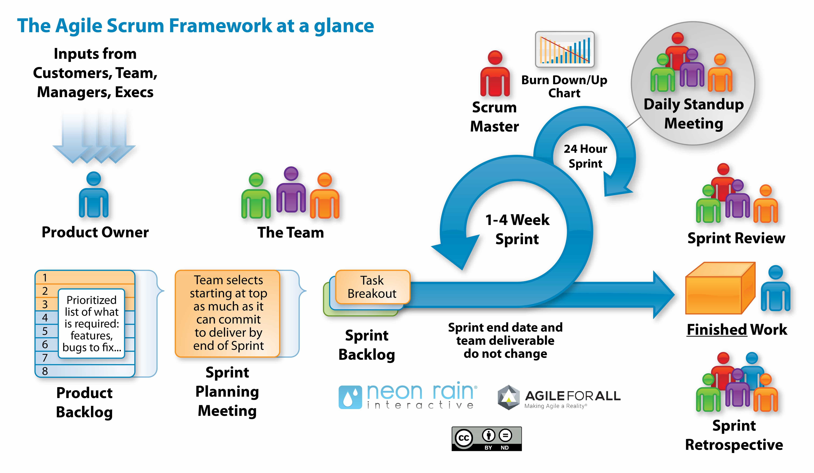

+++
date = '2026-05-18T19:25:09+02:00'
draft = true
title = 'Scrum – Agile Project Management'
+++

More and more programmers are becoming interested in so-called agile project management methodologies. And there is a good reason for that — research done in the USA showed that projects using this approach get better ROI.

The most popular of the agile methodologies is Scrum — an approach created by Ken Schwaber in 1995. Schwaber is also the co-founder of Scrum.org, an organization that teaches companies how to do agile and tries to standardize knowledge of Scrum. It was at Scrum.org where I had the pleasure to start my journey with agile methodologies and where I received my Professional Scrum Master certificate.

Two main features of Scrum are iterative and incremental approaches towards code creation. Iterativity means that the work is done in cycles that usually take between 1 and 4 weeks. Each of them consists of:

-   Planning
-   Actual work (design, implementation, testing)
-   Demonstration, or in short: Demo
-   Retrospective that helps the team to learn from previous mistakes

The incremental approach means that after each cycle there is a ready and working product with new features. In Scrum you never start something that you can’t complete and show at the end of the cycle.

In Scrum there is a concept of a Backlog — a list of all features that you would like to have in your product. In each cycle some of those features get selected and implemented.

A huge advantage of Scrum is providing quick feedback to people responsible for the business side of the project. The progress is clearly visible and measurable, so it’s easy to control spending and organize other activities in the company. Each functionality that gets implemented is instantly ready for testing and checking whether it meets business requirements as expected. In case it doesn’t, there’s still plenty of time to introduce changes.

The advantages of Scrum are clearly visible when you compare it to the previous methodology — Waterfall. This approach had its roots in classical project management thought and assumed designing the whole application before writing the first line of code, implementing the whole application right from the start, and testing assumptions only at the end of the project when you could finally run the code. Until the project was finished, you could not run anything — in a similar way, a car is not functional with only two wheels. The effects were sometimes very harsh. Waterfall led many projects to an epic disaster by showing problems in assumptions way too late in the project, generating additional costs, creating low-quality applications and sometimes falling prey to contractual penalties when the deadline was not met.