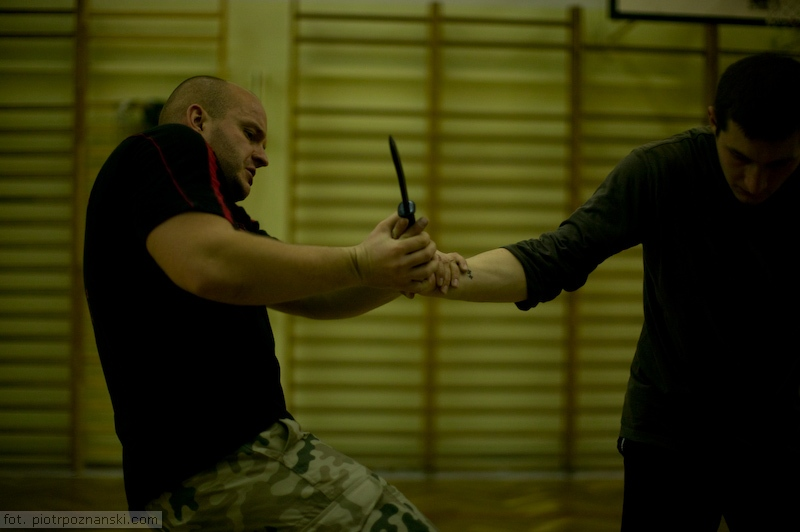
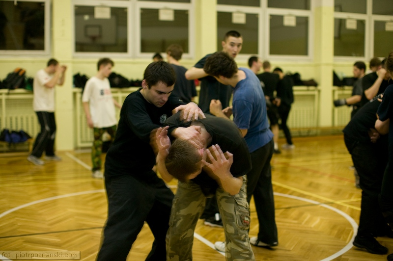
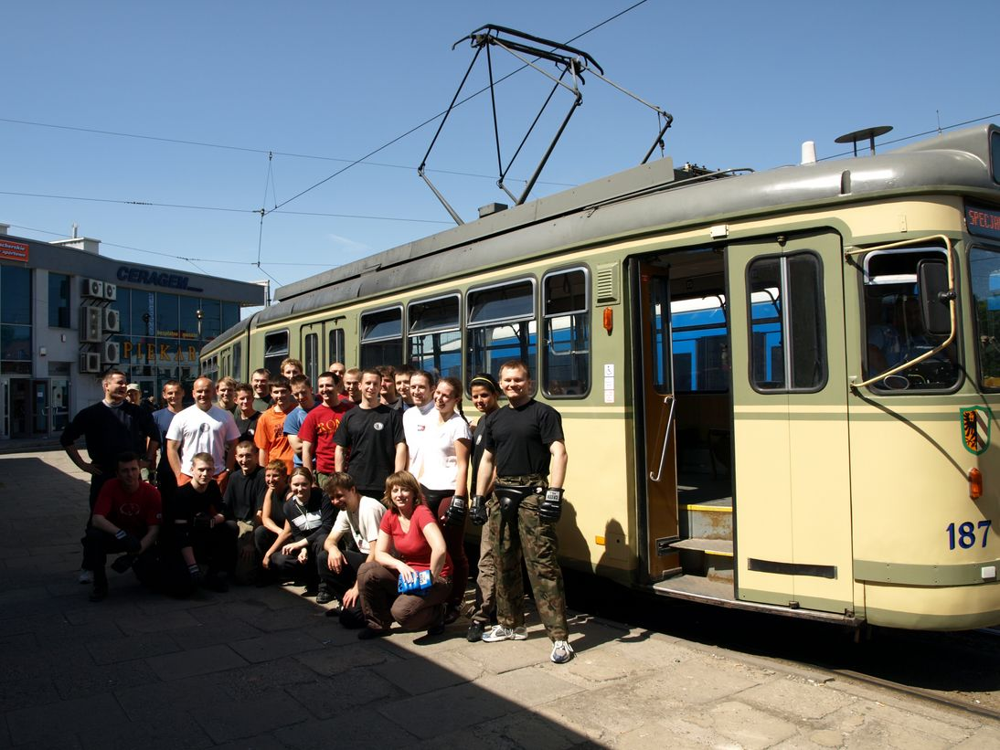
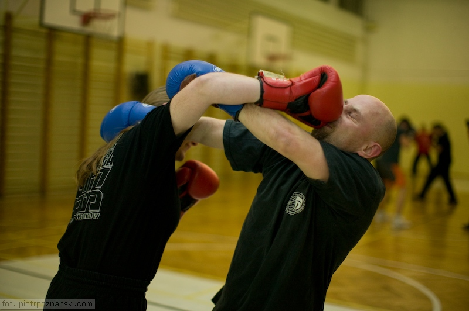
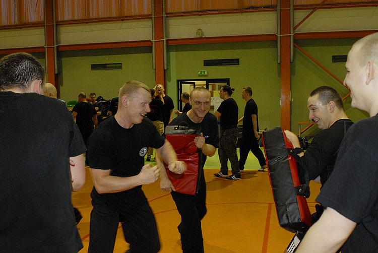

+++
date = '2026-05-18T21:55:27+02:00'
title = 'Krav Maga'
+++

In 2018, after more than seven years of training, I finally passed the black belt exam and became one of the few Krav Maga instructors in Poland.

Krav Maga is a military self-defense and fighting system developed for the Israel Defense Forces (IDF) and Israeli security agencies (Shin Bet and Mossad). It combines techniques sourced from boxing, wrestling, aikido, judo, karate, and several other martial arts. Krav Maga is known for its focus on real-world situations and extreme efficiency.

The system originated from the street-fighting experience of Hungarian-Israeli martial artist Imi Lichtenfeld, who used his training as a boxer and wrestler to defend the Jewish quarter against fascist groups in Bratislava, Czechoslovakia, during the mid-to-late 1930s. In the late 1940s, after emigrating to Israel, he began teaching combat training to what later became the IDF.

*Knife defense technique.*

From the outset, the original concept of Krav Maga was to take the simplest and most practical techniques from other fighting styles (primarily European boxing, wrestling, and street fighting) and make them quickly teachable to military conscripts. Krav Maga emphasizes aggression as well as simultaneous defensive and offensive maneuvers.

Krav Maga has been used by Israeli special forces units, security services, and regular infantry units. Closely related variations have also been developed and adopted by Israeli law enforcement and intelligence organizations. Today, several organizations teach variations of Krav Maga internationally.

*Typical Krav Maga training.*

Some training sessions are conducted in realistic and unusual environments, such as trams. This gives students an opportunity to test their skills in a chaotic environment while the tram is moving during the training. Take a look at one of our training sessions in a tram:

<iframe src="https://www.youtube.com/embed/BuVp7LOhVBQ?rel=0" width="640" height="360" frameborder="0" allowfullscreen="allowfullscreen"></iframe>

Occasionally, training sessions are also held on grass, in darkness, in everyday locations such as cloakrooms, in military buildings, and even in swimming pools.

*Krav Maga group after a training session in the tram.*

I started training Krav Maga as a way to stay in shape. Along the way, however, I discovered what almost all martial artists know: fighting is also a great way to sharpen your mind and attitude. Regular training requires a lot of discipline, high pain tolerance, and motivation.

Most students quit after just a few training sessions, and around 90% stop within several months. Those who continue usually build strong bonds and friendships that extend beyond the training room.

*Sparring — a frequent part of training.*

Fortunately, throughout my entire Krav Maga journey, I have only had to use my skills once — when two much stronger men tried to rob me on my way home in Kraków. Still, it is reassuring to know that in a dangerous situation, you have the skills necessary to protect yourself.

*Knife defense seminar with Amnon Darsa in Kraków, 01/15/2011.*

After years of training, I finally completed an instructor course and started conducting both individual and group training sessions (including groups of more than 40 people) for those who want to learn self-defense quickly.

For me, Krav Maga is still primarily a hobby. The high market demand for software specialists makes changing professions financially impractical. At the same time, seeing young people learn their first Krav Maga techniques and progress along their martial arts journey is extremely rewarding.