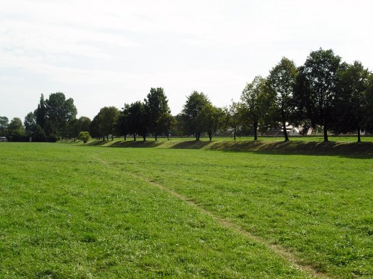
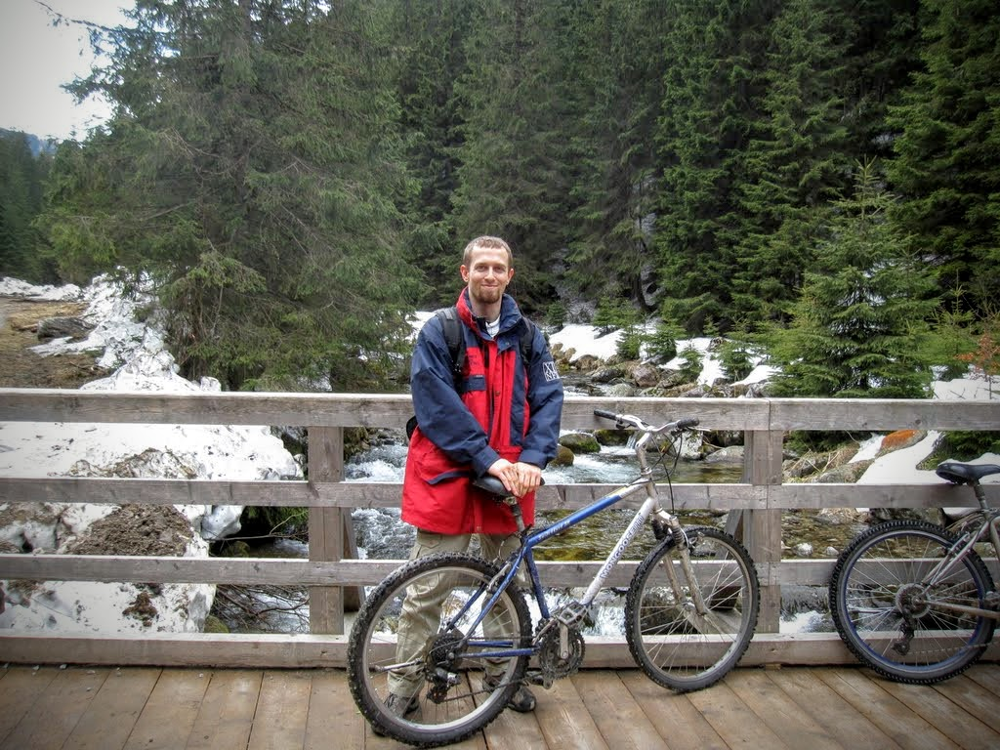

+++
date = '2026-05-18T21:56:00+02:00'
title = 'Long Distance Running'
categories = ["Sport"]
+++

Long-distance running has been my passion for several years. I estimate that during this time I have run around 1,250 miles and completed two marathons.

During my studies, I started running with my friend as a way to keep my body in shape. Back then, I only had a cheap pair of trainers and was able to run one mile at most. What started as an enjoyable way of spending time together and maintaining our friendship quickly turned into a much more extreme version of the sport.

I started running regularly once a week, and the distance constantly increased. I had to replace my cheap sneakers with semi-professional running shoes to get better cushioning and improve my performance. Time quickly passed, and running a half marathon once a week became the norm. That was when I decided to run a full marathon. It took more time and effort than I had expected, mainly because I chose not to use any professional guidance. Instead, I simply kept increasing the distance I ran each week.

Once you start running more than 20 miles once a week, your body starts behaving in a strange way. You lose almost all fat from your body. Your body also tends to burn muscle, so you definitely do not look like a copy of Arnold Schwarzenegger. At the same time, however, your muscles develop extreme endurance. You also tend to spend two days after a run walking like a 90-year-old cripple with both legs broken. But you continue to do it because, at some point, running becomes an addiction. Research shows that during long endurance sports, your body releases a large amount of endorphins, which results in a moderate high.

Finally, after almost three years of training, I ran two full marathons in Cracow, in an area known as Błonia — a great place for runners. By the time I was regularly running around 25 miles once a week, I had become familiar with the entire city of Cracow and most of the small roads, paths, and mountains within 13 miles of where I lived.

*Błonia — the place where I ran a marathon.*

As it turns out, running is a great sport for building endurance and improving your heart and lungs, but not necessarily for your knees. My joints started protesting against running almost a marathon every week, and although consultations with specialists showed that my knees were still healthy, one physician explained clearly to me that running almost a marathon once a week, as I was doing back then, requires perfect genetic predispositions. And there is no reliable way to test for that. If you are unlucky, in the long term you may run into serious problems.

After receiving this advice, I decided to diversify my training. I reduced my running, started martial arts training, and bought two bikes (one for mountain trails and one for paved roads). While I still run once in a while, cycling — which is much safer for the joints — replaced most of my endurance training and allowed me to increase my distances from 25 miles up to 125 miles.

*A mountain trip in Zakopane.*
