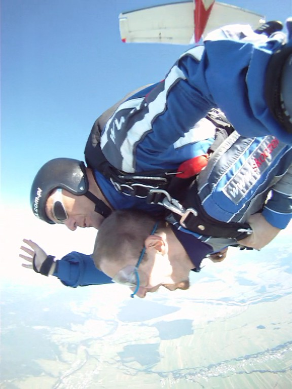
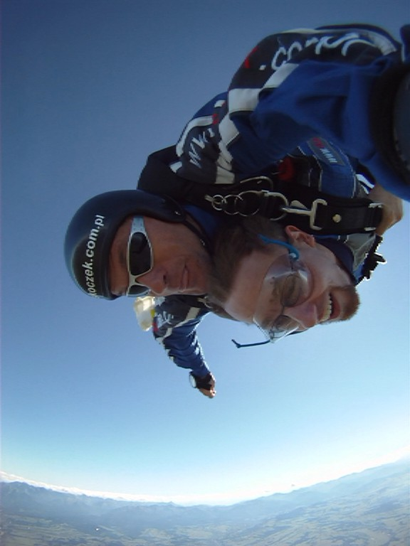
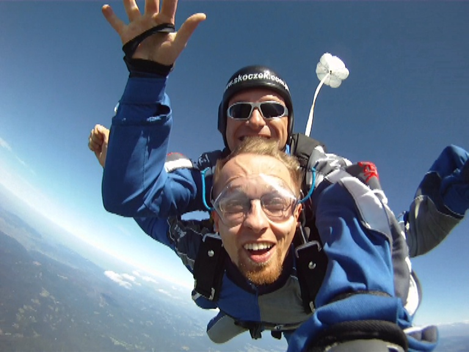
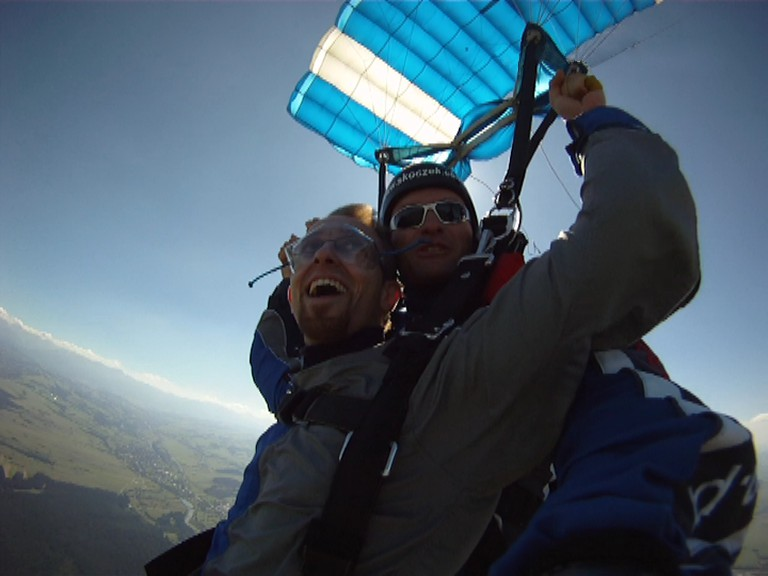

+++
date = '2026-05-18T21:55:09+02:00'
draft = true
title = 'Skydiving'
+++

A parachute jump had always been one of my dreams. I was curious what it’s like to fall at high speed. It took me several years to find a good opportunity (and gather enough courage). But finally, I decided to do a so-called tandem jump, with an instructor attached to my back.

<iframe src="https://player.vimeo.com/video/257260512" width="640" height="564" frameborder="0" allowfullscreen="allowfullscreen"></iframe>

So, what’s it like to do a parachute jump? Contrary to common belief, you don’t need to be in great shape, have perfect health, or complete long courses. You also don’t need permission from your physician. Parachute jumps are relatively safe, and an average person can decide to do one without any previous preparation. You only need courage and some money (in Poland, around 200 USD).

Before the jump, you receive 10 minutes of theoretical training and a jumpsuit. Then you wait for your turn. In the airplane, your instructor straps you to his suit and parachute. Jumps usually take place at 13,000 feet (4,000 meters). It takes around 20 minutes of flight to reach that altitude. Once you get there, you simply open the door and jump.

But it’s not as easy as it looks. The stress is strongest just before the jump. I remember the moment when my instructor opened the door and I saw 13,000 feet of… well, nothing below me. That was the moment when I seriously considered quitting and cowardly going back home alive. Fortunately, my determination was stronger than the temporary fear, and we jumped.

Fifty seconds of free fall at 125 miles per hour makes you feel like a flying bird. The air pressure is so strong that it’s hard to breathe, so you are supposed to breathe through your nose. You can also help yourself by putting your hand in front of your face. The pressure was so intense that it pushed in my eardrums, and after landing I had to blow with my mouth and nose closed to return them to normal. While falling, you almost feel as if you are lying on a pillow made of air. The view of the distant earth getting closer and closer is amazing. It’s hard to describe. I think it’s best to watch the video — or even better, experience it yourself.

After almost a minute, my instructor opened our parachute, and we spent another 10 minutes gliding through the air. My instructor handed me the steering handles, and for a minute I was able to direct our flight myself. He noticed that I actually enjoyed the flight and tolerated the speed well, so he directed the parachute into a spinning carousel maneuver. Eventually, we landed safely.

I think this was the most extreme experience of my life. At the same time, I can genuinely recommend parachute jumping as an amazing experience for anyone brave enough to try it.
